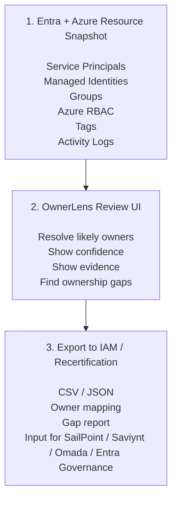

# OwnerLens

OwnerLens is a local Azure ownership report. It reads exported Azure resource
and Microsoft Entra snapshot files, then helps identify likely owners for Azure
subscriptions and resource groups using tags, cost center mappings, role
assignments, managed identities, service principals, application registrations,
groups, and activity-log evidence.

The application is intended to: 

👉 reconcile cloud provider ownership data (currently Azure), 

👉 export the resolved ownership results for Identity and Access Management (IAM) systems, 

OwnerLens helps split actionable remediations by the
most likely accountable owners and provides traceable evidence for why each
remediation was assigned.


## Features

➡️ Resolve owners from configurable Azure tags such as `ownerGroup`,
  `costCenter`, and `owner`. Configure tag names and confidence levels in
  [src/core/config.ts](src/core/config.ts).

➡️ Review ownership confidence and supporting evidence.

➡️ Inspect Azure role assignment and permission risk signals.

➡️ Review managed identity and service principal relationships.

➡️ Export resolved ownership results to CSV and JSON files for resource groups, service principals, and managed identities.


## Requirements

- PowerShell 7 or Windows PowerShell for snapshot export scripts
- Azure PowerShell and Microsoft Graph PowerShell modules when exporting data

## Run With npx

```bash
npx ownerlens start
```

`npx ownerlens start` starts the packaged app on `127.0.0.1`, creates `./data`
in the directory where you run the command, and reads snapshot files from that
directory. Open the local URL printed by the command, usually
`http://127.0.0.1:4173`. When running from a source checkout, run `npm run build`
before `npm run start`.

## Create Snapshot Files

OwnerLens expects these files by default:

- `data/snapshot.json` for Azure resources, role assignments, managed
  identities, and optional Azure Monitor activity logs
- `data/entra-snapshot.json` for Microsoft Entra service principals, application registrations, and groups

Sign in to Azure:

```powershell
Connect-AzAccount
```

Sign in to Microsoft Graph:

```powershell
Connect-MgGraph -TenantId "<tenant-id>" -Scopes "Application.Read.All","Group.Read.All","Directory.Read.All"
```

Import the PowerShell module:

```powershell
Import-Module ./artifacts/OwnerLens/OwnerLens.psd1 -Force
```

Start OwnerLens from PowerShell on Windows:

```powershell
Start-OwnerLens
Open-OwnerLens
Get-OwnerLensStatus
Stop-OwnerLens
```

`Start-OwnerLens` starts the local app on `127.0.0.1` using a free port and
stores runtime state under `$env:LOCALAPPDATA\OwnerLens`. To use a specific data
directory or port, pass them explicitly:

```powershell
Start-OwnerLens -DataPath C:\OwnerLensData -Port 4174
```

Open browser  - even localhost is secured with token
```powershell
Open-OwnerLens
```

Create the resource snapshot:

```powershell
Invoke-OwnerLensCollectAzure -SubscriptionIds "sub-id-1,sub-id-2"
```

Create the Entra snapshot:

```powershell
Invoke-OwnerLensCollectEntra -TenantId "<tenant-id>"
```

More collector options are documented in [tools/README.md](tools/README.md).

Snapshot files can contain tenant, subscription, resource, identity, group, and
activity-log metadata. Review them before sharing. Files matching
`data/*snapshot.json` are ignored by git.

## Development

See [DEVELOPMENT.md](DEVELOPMENT.md) for local development, testing, dependency
graph, project structure, and ownership rule configuration notes.

Contributions are welcome. See [CONTRIBUTING.md](CONTRIBUTING.md) for local
development expectations.

## License

OwnerLens is released under the [Apache License 2.0](LICENSE).
