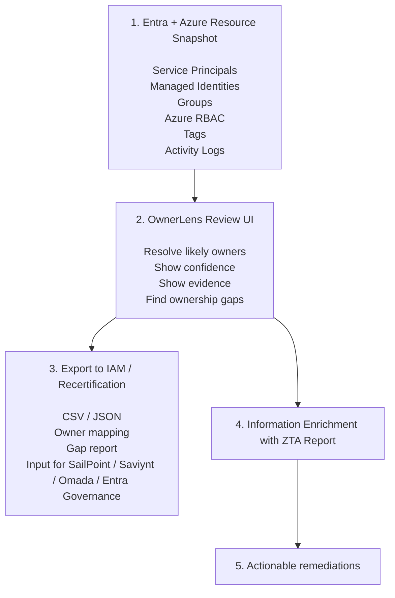

# OwnerLens

OwnerLens is a local Azure ownership report. It reads exported Azure resource
and Microsoft Entra snapshot files, then helps identify likely owners for Azure
subscriptions and resource groups using tags, cost center mappings, role
assignments, managed identities, service principals, application registrations,
groups, and activity-log evidence.

The application is intended to: 

👉 reconcile cloud provider ownership data (currently Azure), 

👉 export the resolved ownership results for Identity and Access Management (IAM) systems, 

👉 support remediation ownership for Zero TrustAssessment (ZTA) findings. 

OwnerLens helps split actionable remediations by the
most likely accountable owners and provides traceable evidence for why each
remediation was assigned.

The app runs locally with Vite. Snapshot file (exported by ./tools/* scripts) stay on your machine and are read
from the repository `data` directory by the development server.

## Features

➡️ Resolve owners from configurable Azure tags such as `ownerGroup`,
  `costCenter`, and `owner`. Configure tag names and confidence levels in
  [src/core/config.ts](src/core/config.ts).

➡️ Review ownership confidence and supporting evidence.

➡️ Inspect Azure role assignment and permission risk signals.

➡️ Review managed identity and service principal relationships.

➡️ Export resolved ownership results to CSV and JSON files for resource groups, service principals, and managed identities.

➡️ Enrich ZTA Assessment findings with ownership context, split actionable
  remediations across accountable teams, and trace remediation assignments back
  to ownership evidence.

➡️ Switch between snapshot files found in `./data`.

## Requirements

- Node.js 20 or newer
- npm
- PowerShell 7 or Windows PowerShell for snapshot export scripts
- Azure PowerShell and Microsoft Graph PowerShell modules when exporting data

## Install

```bash
npm install
```

## Create Snapshot Files

OwnerLens expects these files by default:

- `data/snapshot.json` for Azure resources, role assignments, managed
  identities, and optional Azure Monitor activity logs
- `data/entra-snapshot.json` for Microsoft Entra service principals, application registrations, and groups

Sign in to Azure:

```powershell
Connect-AzAccount
```

Sign in to Microsoft Graph:

```powershell
Connect-MgGraph -TenantId "<tenant-id>" -Scopes "Application.Read.All","Group.Read.All","Directory.Read.All"
```

Create the resource snapshot:

```powershell
.\tools\collect-azure.ps1
```

Create the Entra snapshot:

```powershell
.\tools\collect-entra.ps1
```

More script options are documented in [tools/README.md](tools/README.md).

You can also run the collectors through npm, which is the same entrypoint that
will be used after publishing the package:

```bash
npm run collect:azure -- -SubscriptionIds "sub-id-1,sub-id-2"
npm run collect:entra -- -TenantId "<tenant-id>"
```

Snapshot files can contain tenant, subscription, resource, identity, group, and
activity-log metadata. Review them before sharing. Files matching
`data/*snapshot.json` are ignored by git.

## Run The App

```bash
npm run dev
```

Open the Vite URL printed by the command, usually `http://127.0.0.1:5173`.

For a production build:

```bash
npm run build
npm run preview
```

## Configure Ownership Rules

Edit [src/core/config.ts](src/core/config.ts) to change ownership resolution defaults.

`ownerTags` is ordered by priority. The tag value is treated as the owner
identity and can be a group name, security group alias, or user email.

```ts
export const appConfig = {
  azure: {
    ownership: {
      ownerTags: [
        { name: "ownerGroup", confidence: "high" },
        { name: "costCenter", confidence: "high" },
        { name: "owner", confidence: "medium" }
      ]
    }
  }
};
```

## Test

```bash
npm test
```

Run only component tests:

```bash
npm run test:components
```

Track component-test coverage:

```bash
npm run test:components:coverage
```

The component coverage report is written to `coverage/components`. Jest also
enforces the current component coverage baseline so new UI changes do not
silently reduce coverage.

## Dependency Graph

Generate a folder-level dependency graph:

```bash
npm run deps:graph
```

The generated SVG is written to `output/dependency-folders.svg`.

Generate a file-level dependency graph:

```bash
npm run deps:graph:files
```

The generated SVG is written to `output/dependency-files.svg`.

## Project Structure

- `src/App.tsx` loads snapshot files and renders the report.
- `src/core/config.ts` contains ownership resolution configuration.
- `src/report` contains report UI, filtering, view helpers, and tests.
- `src/providers/azure` contains Azure and Entra domain models and ownership
  analysis logic.
- `tools` contains PowerShell scripts for exporting local snapshot files.

## Contributing

Contributions are welcome. See [CONTRIBUTING.md](CONTRIBUTING.md) for local
development expectations.

## License

OwnerLens is released under the [Apache License 2.0](LICENSE).
