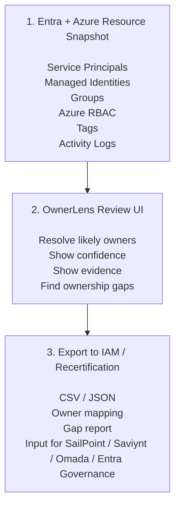

# OwnerLens

OwnerLens is a local-first Azure and Microsoft Entra ownership evidence tool. It
reads snapshots from `./data`, resolves likely accountable owners for Azure
resources and workload identities, shows confidence and evidence trails, and
exports owner mappings, gaps, and remediation assignments to CSV or JSON.

Owner signals include Azure tags, cost center mappings, Azure RBAC, groups,
managed identities, service principals, app registrations, and activity logs.

The application is intended to: 

👉 reconcile cloud provider ownership data (currently Azure), 

👉 export the resolved ownership results for Identity and Access Management (IAM) systems, 

OwnerLens helps split actionable remediations by the
most likely accountable owners and provides traceable evidence for why each
remediation was assigned.


## Features

➡️ Resolve owners from configurable Azure tags such as `ownerGroup`,
  `costCenter`, and `owner`. Configure tag names and confidence levels in
  [src/core/config.ts](src/core/config.ts).

➡️ Review ownership confidence and supporting evidence.

➡️ Inspect Azure role assignment and permission risk signals.

➡️ Review managed identity and service principal relationships.

➡️ Export resolved ownership results to CSV and JSON files for resource groups, service principals, and managed identities.


## Requirements

- PowerShell 7 (`pwsh`) on `PATH` for the OwnerLens module and snapshot
  collectors. Do not use Windows PowerShell (`powershell.exe`).
- Node.js and npm for building from a source checkout.
- Azure PowerShell and Microsoft Graph PowerShell modules when collecting data:

```powershell
Install-Module Az -Scope CurrentUser
Install-Module Az.ManagedServiceIdentity -Scope CurrentUser
Install-Module Microsoft.Graph -Scope CurrentUser
```

Run all PowerShell commands in `pwsh`.

## Create Snapshots

Collectors write these files by default:

- `data/snapshot.json` for Azure subscriptions, resource groups, resources,
  managed identities, role assignments, and optional activity logs.
- `data/entra-snapshot.json` for Microsoft Entra service principals,
  application registrations, groups, and group membership facts.

Sign in from `pwsh`:

```powershell
Connect-AzAccount
Connect-MgGraph -TenantId "<tenant-id>" -Scopes "Application.Read.All","Group.Read.All","Directory.Read.All"
```

Collect snapshots from `pwsh`:

```powershell
Import-Module ./artifacts/OwnerLens/OwnerLens.psd1 -Force
Invoke-OwnerLensCollectAzure -SubscriptionIds "sub-id-1,sub-id-2"
Invoke-OwnerLensCollectEntra -TenantId "<tenant-id>"
```

More collector options are documented in [tools/README.md](tools/README.md).

Snapshot files can contain sensitive tenant, subscription, identity, group,
credential, and activity-log metadata. Review them before sharing. Files matching
`data/*snapshot.json` are ignored by git.


## Run

Build the PowerShell module from a source checkout:

```powershell
pwsh ./scripts/build-windows-runtime.ps1
pwsh ./scripts/build-powershell-module.ps1
```

Start the local app from `pwsh`:

```powershell
Import-Module ./artifacts/OwnerLens/OwnerLens.psd1 -Force
Start-OwnerLens -DataPath ./data
Open-OwnerLens
```

`Start-OwnerLens` binds to `127.0.0.1`, chooses a free port, creates the data
directory, waits up to 180 seconds for the runtime API to become ready, stores
runtime state under `$env:LOCALAPPDATA\OwnerLens`, and writes server stdout/stderr
logs under `$env:LOCALAPPDATA\OwnerLens\logs`.

Use an explicit port or data directory when needed:

```powershell
Start-OwnerLens -Port 4174 -DataPath C:\OwnerLensData
Start-OwnerLens -StartupTimeoutSeconds 240
```

## Development

See [DEVELOPMENT.md](DEVELOPMENT.md) for local development, testing, dependency
graph, and ownership rule configuration notes. See [CONTRIBUTING.md](CONTRIBUTING.md)
for contribution expectations.

Common checks:

```powershell
npm run build
npm test
npm run test:all
npm run lint
```

## License

OwnerLens is released under the [Apache License 2.0](LICENSE).
